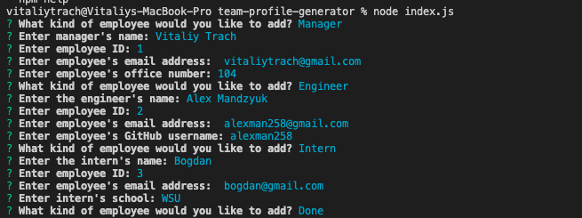
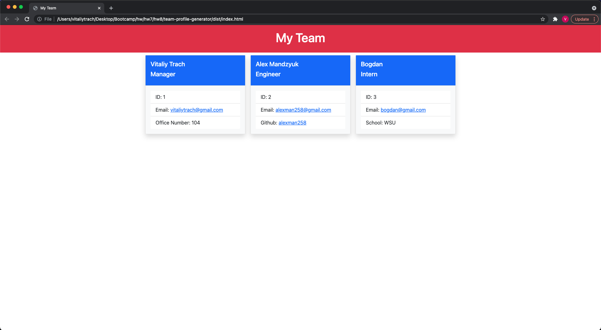

# Team Profile Generator

## Description
This is a command-line application where a user can enter different members of their team and various bits of information about them, and the app generates an HTML page based on that information for easy viewing.
## Table of Contents
- [Installation](#installation)
- [Instructions](#instructions)
- [Credits](#credits)
- [License](#license)
## Installation
Nodejs
## Instructions
First, install all node dependencies, and then use node index.js to run the application  
secondly, Once finished, the HTML page will generate in the folder called "dist"\

Example of running app in the terminal\

\
Example of generated HTML page

## Credits
Vitaliy Trach - [GitHub Profile](https://github.com/vitaliytrach)
## License
This product is licensed under the MIT license.
## How to Contribute
N/A
## Tests
Tests are in the folder called "test", use "npm run test" to see results.
## Questions
Email: vitaliytrach@gmail.com
GitHub: [vitaliytrach](https://github.com/vitaliytrach)